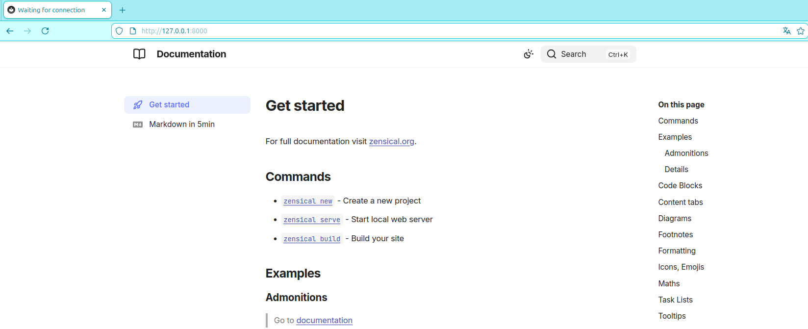

# AE2-zensical-nginx
> Autor: Óscar Regalado León  
> Fecha: Octubre 2026 

Creación de un repositorio en Git y Github. Simulación de un flujo de trabajo entre dos usuarios, aplicación de: (fork, issue, rama, PR, conflicto, etiqueta y release.

## Índice

- [Entorno e instalación](#entorno-e-instalacion)
- [Configuración](#configuracion)
- [Comprobación](#comprobacion)
- [Problemas encontrados y solución](#problemas-encontrados-y-solucion)
- [Repositorio remoto](#repositorio-remoto)

## Entorno e instalación

En primer lugar accedemos al directorio del módulo ~dpl/ y comprobamos lo contenedores creados:
~~~bash
~/dpl$ sudo docker ps -a
CONTAINER ID   IMAGE          COMMAND       CREATED       STATUS                     PORTS     NAMES
f2e4f1d3a079   ubuntu:24.04   "/bin/bash"   2 weeks ago   Exited (137) 2 weeks ago             dpl-cliente
b8c336859c05   ubuntu:24.04   "/bin/bash"   2 weeks ago   Exited (137) 2 weeks ago             dpl-lab
~~~
Levantamos el contenedor de trabajo:
~~~bash
~/dpl$ sudo docker start dpl-lab
dpl-lab
~~~
Comprobamos el estado:
~~~bash
~/dpl$ sudo docker ps
CONTAINER ID   IMAGE          COMMAND       CREATED       STATUS         PORTS                                                                                                                           NAMES
b8c336859c05   ubuntu:24.04   "/bin/bash"   2 weeks ago   Up 6 seconds   0.0.0.0:80->80/tcp, [::]:80->80/tcp, 0.0.0.0:8000->8000/tcp, [::]:8000->8000/tcp, 0.0.0.0:8080->8080/tcp, [::]:8080->8080/tcp   dpl-lab
~~~
Creamos un nuevo repositorio en GitHub:
~~~bash
~/dpl$ gh repo create AE2-zensical-nginx --public --add-readme --license mit
✓ Created repository oregaladoleon/AE2-zensical-nginx on GitHub
  https://github.com/oregaladoleon/AE2-zensical-nginx
~~~
Clonamos el repositorio en nuestro equipo local y creamos un directorio dentro de ~dpl/ llamado AE2/:
~~~bash
~/dpl$ git clone git@github.com:oregaladoleon/AE2-zensical-nginx.git AE2
Clonando en 'AE2'...
remote: Enumerating objects: 4, done.
remote: Counting objects: 100% (4/4), done.
remote: Compressing objects: 100% (3/3), done.
remote: Total 4 (delta 0), reused 0 (delta 0), pack-reused 0 (from 0)
Recibiendo objetos: 100% (4/4), listo.
~~~
Creamos el fichero **.gitignore** dentro del directorio de trabajo AE2/:
~~~bash
~/dpl/AE2$ touch .gitignore

~/dpl/AE2$ nano .gitignore 
~~~
El fichero lo creamos con las siguientes restricciones:
~~~bash
.venv/
__pycache__/
site/
.zensical/
.mkdocs/
*.pyc
.DS_Store
.vscode/
EOF
~~~
Preparamos las modificaciones y las añadimos al repositorio con el **primer commit**
~~~bash
~/dpl/AE2$ git add .gitignore

~/dpl/AE2$ git commit -m "Inicialización repositorio Git y GitHub" -m "Se crea el repositorio AE2-zensical-nginx en GitHub, se clona en local y se añade el fichero .gitignore"
[main 7fb657f] Inicialización repositorio Git y GitHub
 1 file changed, 9 insertions(+)
 create mode 100644 .gitignore

~/dpl/AE2$ git push origin main
Enumerando objetos: 4, listo.
Contando objetos: 100% (4/4), listo.
Compresión delta usando hasta 6 hilos
Comprimiendo objetos: 100% (3/3), listo.
Escribiendo objetos: 100% (3/3), 479 bytes | 119.00 KiB/s, listo.
Total 3 (delta 0), reusados 0 (delta 0), pack-reusados 0
To github.com:oregaladoleon/AE2-zensical-nginx.git
   8011fe0..7fb657f  main -> main
~~~
Debido a que la redacción del histórico de comandos se ha realizado tras ejecutar todos los pasos acontecidos hasta este punto, ejecutamos un **segundo commit** en este punto con la actualización de la documentación.
~~~bash
~/dpl/AE2$ git add README.md 

~/dpl/AE2$ git commit -m "Actualización de documentación" -m "Se actualiza la documentación del fichero README.md ejecutado hasta este punto"
[main d190bf9] Actualización de documentación
 1 file changed, 84 insertions(+), 1 deletion(-)
~~~
---
Procedemos a inicializar **uv** y comprobamos que se crea el directorio correspondiente ~dpl/AE2/src/
~~~bash
~/dpl/AE2$ uv --version
uv 0.12.18 (x86_64-unknown-linux-gnu)

~/dpl/AE2$ uv init
Initialized project `ae2`

~/dpl/AE2$ ll
total 36
drwxrwxr-x 4 oscar oscar 4096 oct  7 14:57 ./
drwxrwxr-x 9 oscar oscar 4096 oct  7 13:14 ../
drwxrwxr-x 8 oscar oscar 4096 oct  7 14:52 .git/
-rw-rw-r-- 1 oscar oscar   75 oct  7 13:15 .gitignore
-rw-rw-r-- 1 oscar oscar 1063 oct  7 13:14 LICENSE
-rw-rw-r-- 1 oscar oscar  350 oct  7 14:57 pyproject.toml
-rw-rw-r-- 1 oscar oscar    5 oct  7 14:57 .python-version
-rw-rw-r-- 1 oscar oscar 3325 oct  7 13:30 README.md
drwxrwxr-x 3 oscar oscar 4096 oct  7 14:57 src/
~~~
Ejecutamos el **tercer commit**:
~~~bash
/dpl/AE2$ git add .

/dpl/AE2$ git commit -m "Inicializamos uv" -m "Ejecutamos *uv init* para crear el directorio del proyecto llamado src/ae2/"
[main 78e37a0] Inicializamos uv
 3 files changed, 20 insertions(+)
 create mode 100644 .python-version
 create mode 100644 pyproject.toml
 create mode 100644 src/ae2/__init__.py

~/dpl/AE2$ git push origin main
Enumerando objetos: 8, listo.
Contando objetos: 100% (8/8), listo.
Compresión delta usando hasta 6 hilos
Comprimiendo objetos: 100% (3/3), listo.
Escribiendo objetos: 100% (7/7), 887 bytes | 221.00 KiB/s, listo.
Total 7 (delta 0), reusados 0 (delta 0), pack-reusados 0
To github.com:oregaladoleon/AE2-zensical-nginx.git
   d190bf9..78e37a0  main -> main
~~~
A continuación, instalamos las dependencias de **Zensical** y se crea el entorno virtual de trabajo **.venv**
~~~bash
~/dpl/AE2$ uv add --dev zensical
Using CPython 3.12.3 interpreter at: /usr/bin/python3.12
Creating virtual environment at: .venv
Resolved 12 packages in 1.62s
      Built ae2 @ file:///home/oscar/dpl/AE2                                                                            Prepared 5 packages in 5.21s
Installed 12 packages in 270ms
 + ae2==0.1.0 (from file:///home/oscar/dpl/AE2)
 + click==8.5.0
 + deepmerge==3.0.1
 + jinja2==3.1.6
 + markdown==3.11
 + markupsafe==3.0.4
 + pathspec==1.1.1
 + pygments==2.21.0
 + pymdown-extensions==12.1
 + pyyaml==6.0.3
 + tomli==2.5.0
 + zensical==0.0.68
~~~
Procedemos a documentar con el **cuarto commit**:
~~~bash
~/dpl/AE2$ git add .

~/dpl/AE2$ git commit -m "Instalación de dependencias Zensical" -m "Se instalan todas las dependencias necesarias y se crea el entorno virtual *.venv*"
[main b82a769] Instalación de dependencias Zensical
 2 files changed, 343 insertions(+)
 create mode 100644 uv.lock

~/dpl/AE2$ git push origin main
Enumerando objetos: 6, listo.
Contando objetos: 100% (6/6), listo.
Compresión delta usando hasta 6 hilos
Comprimiendo objetos: 100% (4/4), listo.
Escribiendo objetos: 100% (4/4), 23.31 KiB | 11.66 MiB/s, listo.
Total 4 (delta 2), reusados 0 (delta 0), pack-reusados 0
remote: Resolving deltas: 100% (2/2), completed with 2 local objects.
To github.com:oregaladoleon/AE2-zensical-nginx.git
   78e37a0..b82a769  main -> main
~~~
Creamos el conjunto de directorios y ficheros base de zensical:
~~~bash
~/dpl/AE2$ uv run zensical new .

~/dpl/AE2$ ll
total 128
drwxrwxr-x 7 oscar oscar  4096 oct  7 15:05 ./
drwxrwxr-x 9 oscar oscar  4096 oct  7 13:14 ../
drwxrwxr-x 2 oscar oscar  4096 oct  7 15:05 docs/
drwxrwxr-x 8 oscar oscar  4096 oct  7 15:04 .git/
drwxrwxr-x 3 oscar oscar  4096 oct  7 15:05 .github/
-rw-rw-r-- 1 oscar oscar    75 oct  7 13:15 .gitignore
-rw-rw-r-- 1 oscar oscar  1063 oct  7 13:14 LICENSE
-rw-rw-r-- 1 oscar oscar   405 oct  7 15:02 pyproject.toml
-rw-rw-r-- 1 oscar oscar     5 oct  7 14:57 .python-version
-rw-rw-r-- 1 oscar oscar  3325 oct  7 13:30 README.md
drwxrwxr-x 3 oscar oscar  4096 oct  7 14:57 src/
-rw-rw-r-- 1 oscar oscar 74072 oct  7 15:02 uv.lock
drwxrwxr-x 4 oscar oscar  4096 oct  7 15:02 .venv/
-rw-rw-r-- 1 oscar oscar  2974 oct  7 15:05 zensical.toml
~~~
Procedemos a documentar con el **quinto commit**:
~~~bash
~/dpl/AE2$ git add .

~/dpl/AE2$ git commit -m "Creación de la estructura base de zensical" -m "Se genera el directorio /docs, se crea el fichero de configuración zensical.toml y un fichero index.md"
[main 5fcba77] Creación de la estructura base de zensical
 4 files changed, 431 insertions(+)
 create mode 100644 .github/workflows/docs.yml
 create mode 100644 docs/index.md
 create mode 100644 docs/markdown.md
 create mode 100644 zensical.toml

~/dpl/AE2$ git push origin main
Enumerando objetos: 10, listo.
Contando objetos: 100% (10/10), listo.
Compresión delta usando hasta 6 hilos
Comprimiendo objetos: 100% (7/7), listo.
Escribiendo objetos: 100% (9/9), 4.14 KiB | 385.00 KiB/s, listo.
Total 9 (delta 1), reusados 0 (delta 0), pack-reusados 0
remote: Resolving deltas: 100% (1/1), completed with 1 local object.
To github.com:oregaladoleon/AE2-zensical-nginx.git
   b82a769..5fcba77  main -> main
~~~
Comprobamos que se ejecuta correctamente en local arrancando el servidor de desarrollo:
~~~bash
~/dpl/AE2$ uv run zensical serve
Serving /home/oscar/dpl/AE2/site on http://localhost:8000
Build started
No issues found
^CReceived interrupt, exiting
~~~
Observamos en el navegador que introduciendo http://127.0.0.1:8000 en el navegador se visualiza la plantilla por defecto de zensical.

Ejecutamos un **sexto commit** para dejar actualizado el documento README.md del proceso.
---
## Configuración
Vamos a crear todos los ficheros correspondientes a la estructura de la página web y a editarlos.
~~~bash
~/dpl/AE2$ cd docs/

~/dpl/AE2/docs$ ll
total 16
drwxrwxr-x  2 oscar oscar 4096 oct  7 15:05 ./
drwxrwxr-x 10 oscar oscar 4096 oct  7 15:24 ../
-rw-rw-r--  1 oscar oscar 3839 oct  7 15:05 index.md
-rw-rw-r--  1 oscar oscar 1233 oct  7 15:05 markdown.md
~/dpl/AE2/docs$ nano index.md 

~/dpl/AE2/docs$ touch entorno.md
~~~
El fichero **index.md** tendrá el siguiente contenido:
~~~bash
# AE2: Despliegue de un sitio web estático con Nginx y Zensical.
Se trata de un sitio web que documenta todo el proceso realizado por el alumno del módulo de Despliegue de Aplicaciones Web (DPL) del segundo curso de DAW.
## Objetivo.
El fin de este sitio web es documentar el proceso de construcción y despliegue de un sitio web estático generado con **Zensical** (basado en MkDocs) y servido mediante un servidor web **Nginx** dentro de un contenedor Docker **'dpl-lab'**.
## Estructura de la documentación.
- **Entorno de trabajo e instalación:**: Preparación de la máquina virtual, Git, GitHub y entorno Python con 'uv'.
- **Configuración de Zensical**: Instalación, estructura de archivos y compilación.
- **Servidor Nginx y despliegue en producción**: Configuración del Server Block y despliegue en producción.
## Autor.
El alumno Óscar Regalado León.
~~~
El resto de ficheros tendrán el contenido expuesto en esta documentación README.md pero distribuida según su categoría.
Generaremos un **commit** por cada fichero creado y editado. Por lo tanto el **séptimo commit** está vinculado a la edición del fichero **index.html**
~~~bash
~/dpl/AE2/docs$ git add index.md 

~/dpl/AE2/docs$ git commit -m "Edición de index.md" -m "Se edita con el contenido de la página principal el fichero index.md"
[main 687a3a7] Edición de index.md
 1 file changed, 10 insertions(+), 173 deletions(-)

~/dpl/AE2/docs$ git push origin main
Enumerando objetos: 7, listo.
Contando objetos: 100% (7/7), listo.
Compresión delta usando hasta 6 hilos
Comprimiendo objetos: 100% (4/4), listo.
Escribiendo objetos: 100% (4/4), 856 bytes | 122.00 KiB/s, listo.
Total 4 (delta 1), reusados 0 (delta 0), pack-reusados 0
remote: Resolving deltas: 100% (1/1), completed with 1 local object.
To github.com:oregaladoleon/AE2-zensical-nginx.git
   be68d7d..687a3a7  main -> main
~~~
El **octavo commit** está vinculado a la creación y edición del fichero ~dpl/AE2/docs/entorno.md:
~~~bash
~/dpl/AE2/docs$ git add entorno.md 

~/dpl/AE2/docs$ git commit -m "Creación y edición del fichero entorno.md" -m "Se crea y se edita en el directorio ~dpl/AE2/docs/ el fichero entorno.md con el contenido correspondiente."
[main 7783cbb] Creación y edición del fichero entorno.md
 1 file changed, 96 insertions(+)
 create mode 100644 docs/entorno.md

~/dpl/AE2/docs$ git push origin main
Enumerando objetos: 6, listo.
Contando objetos: 100% (6/6), listo.
Compresión delta usando hasta 6 hilos
Comprimiendo objetos: 100% (4/4), listo.
Escribiendo objetos: 100% (4/4), 1.98 KiB | 337.00 KiB/s, listo.
Total 4 (delta 1), reusados 0 (delta 0), pack-reusados 0
remote: Resolving deltas: 100% (1/1), completed with 1 local object.
To github.com:oregaladoleon/AE2-zensical-nginx.git
   687a3a7..7783cbb  main -> main
~~~
El **noveno commit** está vinculado a la creación y edición del fichero ~dpl/AE2/docs/zensical.md:
~~~bash
/dpl/AE2/docs$ touch zensical.md

~/dpl/AE2/docs$ git add zensical.md 

~/dpl/AE2/docs$ git commit -m "Creación y edición del fichero zensical.md" -m "Se crea y edita en el directorio ~dpl/AE2/docs/ el fichero zensical.md con el contenido correspondiente."
[main fd9af86] Creación y edición del fichero zensical.md
 1 file changed, 145 insertions(+)
 create mode 100644 docs/zensical.md

~/dpl/AE2/docs$ git push origin main
Enumerando objetos: 6, listo.
Contando objetos: 100% (6/6), listo.
Compresión delta usando hasta 6 hilos
Comprimiendo objetos: 100% (4/4), listo.
Escribiendo objetos: 100% (4/4), 2.20 KiB | 250.00 KiB/s, listo.
Total 4 (delta 2), reusados 0 (delta 0), pack-reusados 0
remote: Resolving deltas: 100% (2/2), completed with 2 local objects.
To github.com:oregaladoleon/AE2-zensical-nginx.git
   7783cbb..fd9af86  main -> main
~~~
Ahora debemos editar el fichero de configuración general ~dpl/AE2/zensical.toml para establecer los ficheros .md alojados en ~dpl/AE2/docs/ que deben aparecer en la web como pestañas. Añadimos en el apartado de [nav]
~~~
[project]
site_url = "https://www.example.com/"
site_name = "AE2 - Despliegue Nginx y Zensical"
# site_description = "Your project description"
# site_author = "Your name"

# copyright = "Copyright &copy; 2026 Your name"

# repo_url = "https://github.com/user/repo"
# repo_name = "user/repo"
# edit_uri = "edit/main/docs/"

nav = [
    { "Inicio" = "index.md" },
    { "Entorno de Trabajo" = "entorno.md" },
    { "Zensical" = "zensical.md" },
    { "Nginx y Despliegue" = "nginx.md" }
]
~~~

Comprobamos el funcionamiento correcto aplicando:
~~~bash
~/dpl/AE2$ uv run zensical serve
Serving /home/oscar/dpl/AE2/site on http://localhost:8000
Build started
No issues found
~~~